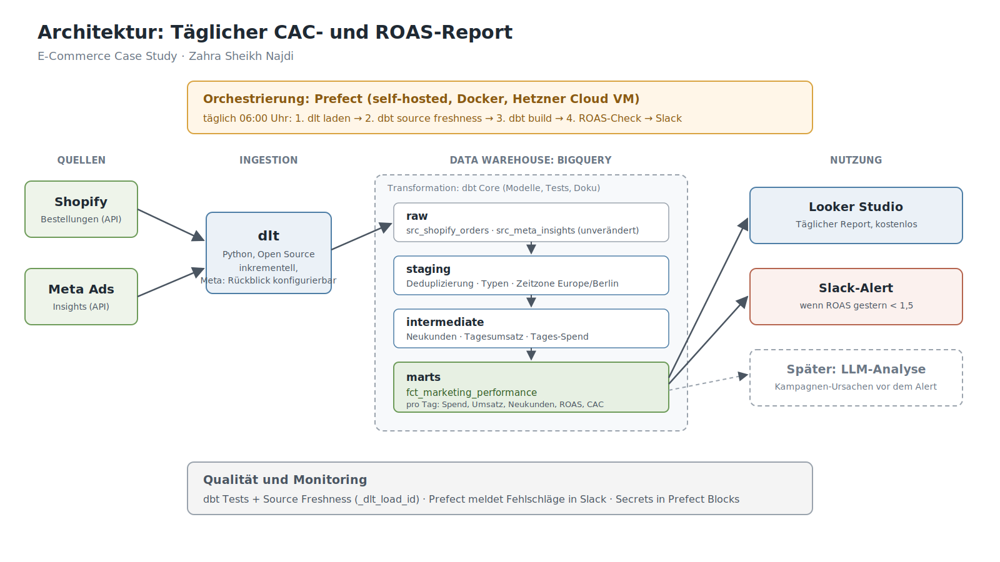

# Marketing Performance Case: täglicher CAC- und ROAS-Report

Case Study: Shopify-Bestellungen und Meta-Ads-Ausgaben werden täglich zusammengeführt,
um CAC (Customer Acquisition Cost) und ROAS (Return on Ad Spend) auszuweisen.
Fällt der ROAS des Vortags unter 1,5, geht ein Alert an Slack.

## Architektur



Tägliche Pipeline: dlt → `dbt source freshness` → `dbt build` → ROAS-Check → Slack.
Report in Looker Studio.

## Struktur

```
.
├── dbt/
│   ├── dbt_project.yml
│   ├── packages.yml
│   ├── models/
│   │   ├── staging/        Deduplizierung, Typen, Zeitzone, Tests
│   │   ├── intermediate/   Neukunden, Tagessummen
│   │   └── marts/          fct_marketing_performance mit Tages- und 7-Tage-Werten
│   └── tests/              eigener Test: Spend ohne Bestellungen
├── automation/
│   ├── alert_logic.py            Entscheidung und Slack-Nachrichten, ohne Abhängigkeiten
│   ├── roas_alert_flow.py        Prefect-Flow
│   ├── test_decide_action.py     Tests der Logik
│   ├── test_flow_mocked.py       Test des kompletten Flows
│   └── requirements.txt
├── local_check/
│   └── check_logic_duckdb.py     Modelllogik mit Beispieldaten und Erwartungswerten
└── docs/
    └── architektur.png
```

## Ausführen

**dbt** (ab Version 1.10, Voraussetzung: eine `profiles.yml` mit BigQuery-Verbindung, nicht im Repo):

```
cd dbt
dbt deps
dbt source freshness
dbt build
```

**Tests der Alert-Logik** (ohne BigQuery und ohne Slack):

```
python automation/test_decide_action.py
```

**Test des kompletten Prefect-Flows** (BigQuery und Slack simuliert):

```
pip install -r automation/requirements.txt
python automation/test_flow_mocked.py
```

**Modelllogik mit Beispieldaten:**

```
pip install duckdb
python local_check/check_logic_duckdb.py
```

## Annahmen

- Die Ingestion (dlt) ist gegeben und **nicht Teil dieses Repos**. Sie schreibt `_dlt_load_id` in jede Zeile.
- Das Rückblickfenster für Meta (z. B. 28 Tage) wird in der Ingestion konfiguriert. dbt lädt nichts neu, sondern behält pro Tag und Kampagne die neueste Version.
- Meta-Werbekonto in Europe/Berlin, Beträge in EUR.
- Vollständige Shopify-Historie ab Shop-Start.

## Wichtigste Entscheidungen

- **CAC über Neukunden**, nicht über alle Bestellungen.
- **Blended ROAS und CAC:** Gesamtumsatz beziehungsweise alle Neukunden im Verhältnis zum Meta-Spend. Nicht die Werte aus dem Meta Ads Manager.
- **Zeitzone Europe/Berlin** vor dem Join, sonst landen Bestellungen nach Mitternacht am falschen Tag.
- **Meta-Korrekturen:** Die Ingestion lädt ein Rückblickfenster neu, im Staging gewinnt die neueste Ladung.
- **7-Tage-Werte** zusätzlich zum Tageswert, weil ein Kauf oft Tage nach dem Klick passiert.
- **Alert unterscheidet** einen echten ROAS-Einbruch von einer Auffälligkeit in den Daten.

Details und Begründungen stehen im beigefügten PDF.
